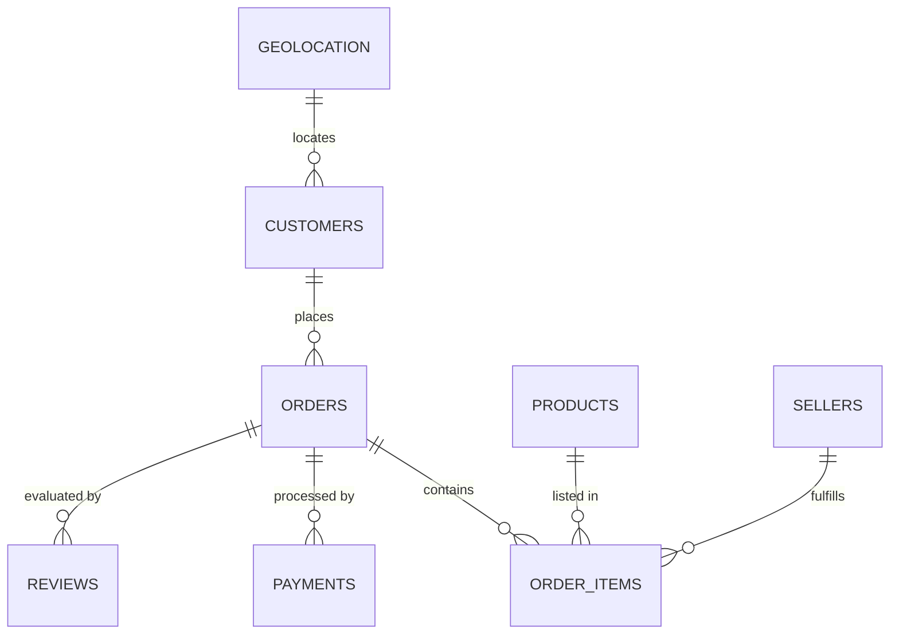
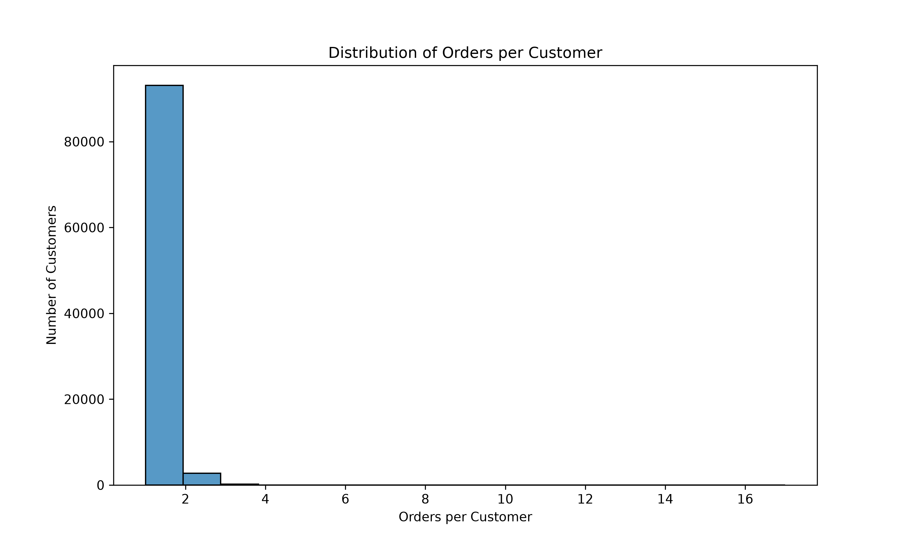
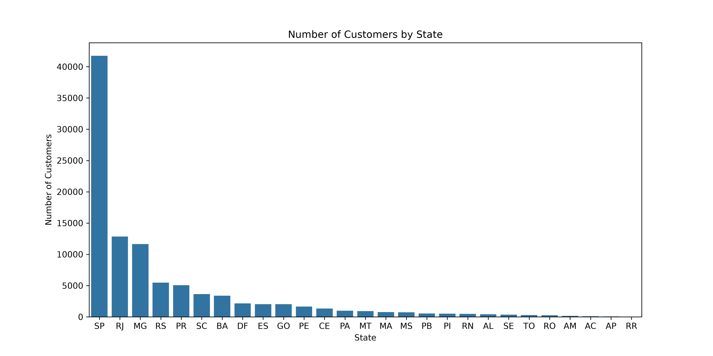
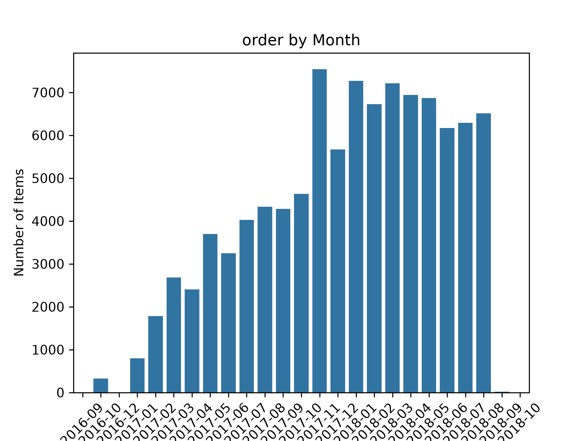
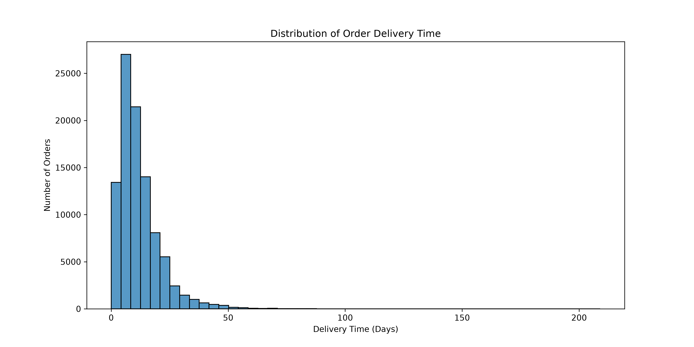
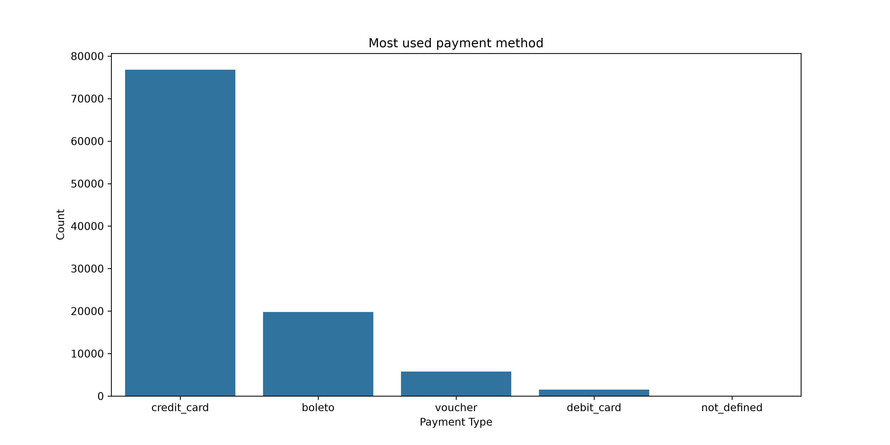
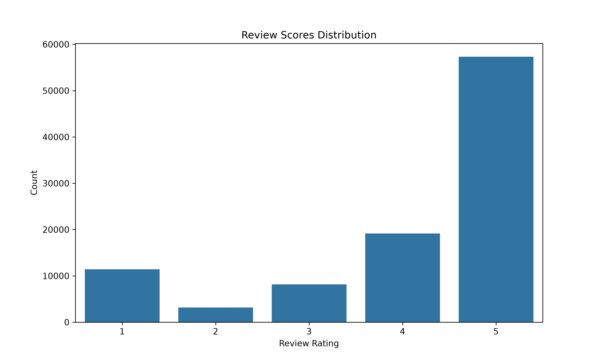
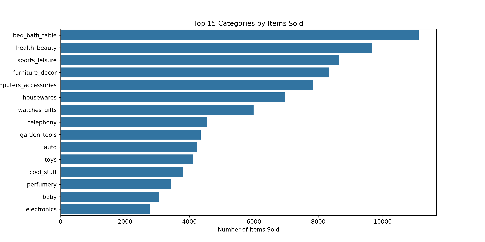
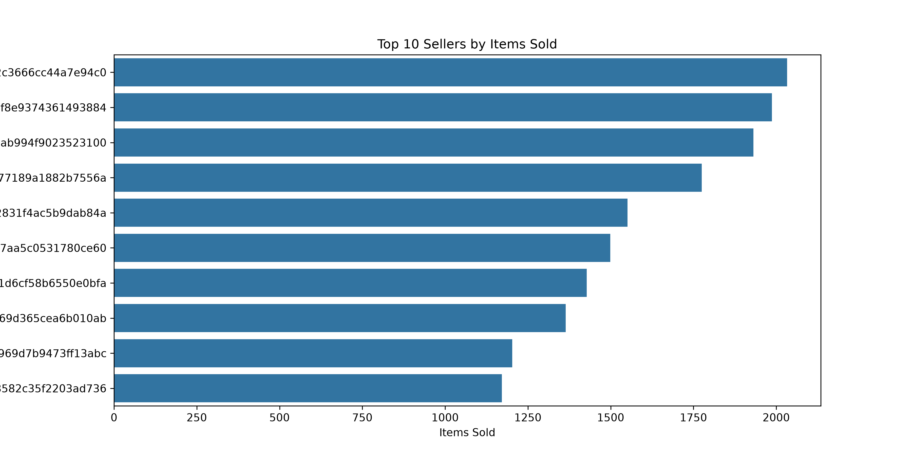

<div align="center">

# Brazilian E-Commerce Analytics & Data Engineering Pipeline

An end-to-end data engineering and exploratory analytics project built on the Olist Brazilian E-Commerce dataset.

[](https://www.python.org/)
[](https://spark.apache.org/docs/latest/api/python/)
[](https://pandas.pydata.org/)
[](https://jupyter.org/)
[](#license)

</div>

## Overview

This project turns raw Brazilian marketplace data into a reproducible analytics and data-engineering workflow. It combines table-level and relationship-level EDA with a Spark-based medallion architecture: raw CSV files are ingested into Bronze Parquet, standardized in Silver, and modeled into purpose-specific Gold datasets. The analysis focuses on customer retention, regional demand, payments, products, sellers, reviews, and delivery performance, producing evidence that can support marketplace strategy, operational planning, and future machine-learning work.

The project is intentionally designed around data grain and safe joins. For example, payment and item records are aggregated to order grain before being joined to orders, while `customer_unique_id` is used for customer-level analysis instead of treating every `customer_id` record as a permanent customer identity.

## What This Project Does

- Ingests eight Olist source tables with PySpark and preserves source data in Bronze Parquet.
- Performs focused EDA for customers, geolocation, orders, order items, payments, reviews, products, sellers, and category performance.
- Analyzes relationships between customers and orders, orders and payments, orders and reviews, items and products, and items and sellers.
- Standardizes identifiers, numeric columns, timestamps, null handling, and exact duplicates in Silver.
- Preserves legitimate one-to-many relationships such as multiple payments per order and repeated geolocation observations per ZIP prefix.
- Builds Gold datasets at explicit grains: customer, order, product, seller, and delivery.
- Creates a customer-level repeat-purchase dataset as a foundation for future leakage-aware ML modeling.
- Exports publication-ready charts and optional interactive geolocation maps.

## Architecture

```text
Raw CSV files
	|
	v
Bronze: source-preserving Parquet + ingestion metadata
	|
	v
Silver: typed, cleaned, standardized source-level datasets
	|
	v
Gold: customer, sales, product, seller, delivery, and ML-ready datasets
	|
	+--> EDA / visualization
	+--> Business analytics
	+--> Future ML feature engineering
```
### Entity Relationship Diagram (Inferred)


---

### Data-grain decisions

| Dataset | Grain | Important modeling decision |
|---|---|---|
| `customers` | One row per `customer_id` | Keep both `customer_id` and `customer_unique_id`; the latter represents the customer across orders. |
| `orders` | One row per `order_id` | Do not duplicate orders through direct joins to item or payment detail. |
| `order_items` | One product item within an order | Aggregate to order grain before order-level analysis. |
| `order_payments` | One payment record within an order | Preserve multiple records; aggregate payment metrics before joining to orders. |
| `order_reviews` | Review record associated with an order | Keep missing reviews as missing, not as a score of zero. |
| `geolocation` | Many observations per ZIP prefix | Silver produces a representative ZIP-prefix location using aggregated coordinates. |

## Technology Stack

| Area | Tools |
|---|---|
| Language | Python 3.13+ |
| Distributed processing | Apache Spark / PySpark 4.2+ |
| EDA and tabular analysis | Pandas, NumPy |
| Visualization | Matplotlib, Seaborn |
| Interactive maps | Folium |
| Development environment | JupyterLab, VS Code, Poetry |
| Storage format | CSV source files, Parquet Bronze/Silver/Gold layers |

## Project Structure

```text
.
├── data/
│   ├── raw/                         # Downloaded Olist CSV files; ignored by Git
│   ├── bronze/                      # Source-preserving Parquet outputs
│   ├── silver/                      # Cleaned and standardized Parquet datasets
│   └── gold/                        # Business-ready analytical datasets
├── notebooks/
│   ├── eda/
│   │   ├── 01_customers_eda.ipynb
│   │   ├── 02_geolocation_eda.ipynb
│   │   ├── 03_order_items_eda.ipynb
│   │   ├── 04_order_payments.ipynb
│   │   ├── 05_order_reviews_eda.ipynb
│   │   ├── 06_orders_eda.ipynb
│   │   ├── 07_products_eda.ipynb
│   │   ├── 08_sellers_eda.ipynb
│   │   ├── 09_product_category_eda.ipynb
│   │   └── 10_relationship_eda.ipynb
│   └── pipeline/
│       ├── 01_bronze_ingestion.ipynb
│       ├── 02_silver_transformation.ipynb
│       └── 03_gold_analytics.ipynb
├── output/
│   └── charts/                      # Checked-in EDA visualizations
├── local_outputs/                   # Optional local maps; ignored by Git
├── models/                          # Reserved for future ML artifacts
├── src/                             # Reserved for reusable Python modules
├── pyproject.toml                   # Poetry project and dependencies
└── README.md
```

## Setup and Installation

### Prerequisites

- Python 3.13 or newer
- Java compatible with the installed Spark distribution
- Git
- Poetry, or a Python environment capable of installing the dependencies in `pyproject.toml`
- On Windows, a working local Hadoop/Spark configuration may be required for PySpark file operations, including `HADOOP_HOME` and `hadoop.home.dir` configuration.

### Clone and install

```bash
git clone <your-repository-url>
cd E-commerce-Store-Analysis

poetry install
poetry run jupyter lab
```

If you are not using Poetry:

```bash
python -m venv .venv

# Windows PowerShell
.\.venv\Scripts\Activate.ps1

# macOS/Linux
# source .venv/bin/activate

pip install pandas numpy matplotlib seaborn jupyterlab ipykernel folium pyspark
jupyter lab
```

Open the notebooks with their containing folder as the notebook working directory so the existing relative paths such as `../../data/raw` resolve correctly.

## Data Source and Download

The project uses the [Brazilian E-Commerce Public Dataset by Olist](https://www.kaggle.com/datasets/olistbr/brazilian-ecommerce) from Kaggle. The raw CSV files are not committed because several files exceed GitHub's recommended file-size limits.

### Download manually

1. Create or sign in to a Kaggle account.
2. Open the [Olist Brazilian E-Commerce dataset](https://www.kaggle.com/datasets/olistbr/brazilian-ecommerce).
3. Download the dataset ZIP file.
4. Extract all CSV files into `data/raw/`.
5. Confirm that the raw directory contains these files:

```text
olist_customers_dataset.csv
olist_geolocation_dataset.csv
olist_order_items_dataset.csv
olist_order_payments_dataset.csv
olist_order_reviews_dataset.csv
olist_orders_dataset.csv
olist_products_dataset.csv
olist_sellers_dataset.csv
product_category_name_translation.csv
```

The repository ignores `data/raw/*.csv`, so downloaded data will remain local and will not be accidentally committed.

## How to Run the Project

Run the pipeline notebooks in this order:

### Bronze ingestion

Open `notebooks/pipeline/01_bronze_ingestion.ipynb` and run all cells. This reads the raw CSV files, adds `_ingested_at` and `_source` metadata, and writes one Parquet dataset per source table under `data/bronze/`.

### Silver transformation

Open `notebooks/pipeline/02_silver_transformation.ipynb` and run all cells. The notebook reads only Bronze Parquet, performs type and quality transformations, validates key behavior, and writes cleaned datasets under `data/silver/`.

### Gold analytics

Open `notebooks/pipeline/03_gold_analytics.ipynb` and run all cells. The notebook aggregates one-to-many tables before joining, validates analytical keys, and writes these Gold outputs:

```text
data/gold/customer_analytics/
data/gold/sales_analytics/
data/gold/product_analytics/
data/gold/seller_analytics/
data/gold/delivery_analytics/
data/gold/ml_customer_repeat/
```

### Run the EDA notebooks

The EDA notebooks can be opened individually after the raw files are available. A practical order is:

1. Run the individual table EDA notebooks in `notebooks/eda/`.
2. Run `10_relationship_eda.ipynb` after the individual tables have been inspected.
3. Review the generated charts in `output/charts/`.

The EDA notebooks use the raw CSV layer directly, while the engineering notebooks use the medallion layers. This keeps exploratory work transparent and pipeline work reproducible.

## EDA and Key Insights

The following charts are generated by the notebooks and checked into `output/charts/`.

### Customer retention and geography



*The distribution is strongly concentrated at one order per customer. The EDA identified 96,096 unique customers, 99,441 orders, and a repeat-customer rate of approximately 3.12%, making retention a central business opportunity.*



*Customer activity is concentrated in Brazil's Southeast, especially São Paulo, Rio de Janeiro, and Minas Gerais. The top three states account for approximately 65.9% of customers in the relationship analysis.*

### Order volume and fulfillment



*Order activity grows substantially from 2017 onward, with the strongest monthly activity appearing across 2017 and 2018.*



*Delivered orders are concentrated around shorter delivery times, with a right tail representing slower deliveries. The EDA reported an average delivery time of approximately 12 days and a median of approximately 10 days.*

### Payments and customer experience



*Credit cards dominate payment activity, representing approximately 73.92% of payment records in the payment EDA. Credit-card transactions also account for most installment behavior.*



*Submitted reviews are skewed toward four- and five-star scores. Review coverage is only about 55%, so missing reviews must not be interpreted as negative ratings.*

### Products and sellers



*A relatively small set of categories leads item demand, with bed/bath table, health/beauty, sports/leisure, and furniture/decor among the strongest categories in the generated analysis.*



*Seller activity is concentrated among a small group of high-volume sellers, which is useful for marketplace dependency analysis and seller-performance monitoring.*

More visualizations are available in the subdirectories under [`output/charts/`](output/charts/), including payment installments, order-item pricing, product dimensions, seller geography, and category revenue.

## Results and Business Findings

| Area | Finding | Implication |
|---|---|---|
| Customer retention | Approximately 96.9% of customers place only one order; repeat customers represent about 3.12%. | Prioritize post-purchase engagement, lifecycle messaging, and retention experiments. |
| Regional concentration | São Paulo contributes roughly 41.6% of customers and leads total order value; the Southeast dominates overall activity. | Concentration supports efficient operations but creates regional dependency risk. |
| Order completion | Delivered orders are the dominant status across the dataset. | The core fulfillment process is broadly successful, while exceptional statuses deserve targeted investigation. |
| Delivery | Delivery times cluster around roughly 10–12 days but include a long tail of slow deliveries. | Segment late orders by state, seller, product, and carrier-stage timestamps. |
| Payments | Credit cards are the leading payment method; higher payment values show a weak-to-moderate positive relationship with installment count. | Payment and financing behavior can inform checkout and promotion strategy. |
| Reviews | Ratings are mostly positive among submitted reviews, but approximately 45% of orders have no recorded review. | Review outreach can improve feedback coverage without treating non-response as dissatisfaction. |
| Products | Demand is concentrated across leading product categories, with meaningful variation in price and volume. | Category-level assortment, cross-selling, and inventory analysis are natural next steps. |
| Sellers | A small number of sellers account for a substantial share of activity. | Monitor key-seller dependency and develop seller performance benchmarks. |

## Data Engineering Quality Principles

This project emphasizes correctness over simply producing a large denormalized table:

- Bronze preserves source rows and ingestion metadata.
- Silver applies minimal, explainable cleaning and retains useful source grains.
- Exact duplicates are removed only when the entire row is duplicated; legitimate repeated keys are preserved.
- Payments, items, and reviews are aggregated before order-level joins to prevent row multiplication.
- Gold datasets declare their target grain and validate duplicate analytical keys.
- Nulls are treated according to meaning: a missing delivery timestamp is not fabricated, and a missing review is not converted to score zero.

## Future Roadmap

- Add automated data-quality tests with a framework such as Great Expectations or Pytest.
- Add orchestration with Dagster, Airflow, or a lightweight task runner.
- Add incremental ingestion and partitioning strategies for larger datasets.
- Improve Windows Spark setup documentation and add a platform-neutral execution path.
- Add category-name translation enrichment to analytical outputs.
- Build leakage-safe time-window features for repeat-purchase prediction.
- Add delivery-delay prediction after defining a prediction-time feature set.
- Publish a dashboard using the Gold datasets and generated metrics.

## License

This project is licensed under the MIT License. See [LICENSE.md](LICENSE) for the full license text.

The Olist dataset is subject to its own terms on [Kaggle](https://www.kaggle.com/datasets/olistbr/brazilian-ecommerce); review those terms before redistributing the data or derived artifacts.

## Credits and Contact

- Dataset: [Olist Brazilian E-Commerce Public Dataset](https://www.kaggle.com/datasets/olistbr/brazilian-ecommerce)
- Project author: Tanmay Aggarwal
- Contact: tanmayagg.2005@gmail.com

Contributions, issue reports, and suggestions for improving the pipeline's data-quality checks are welcome.
